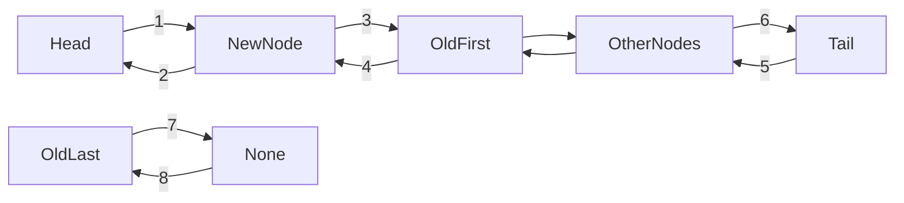
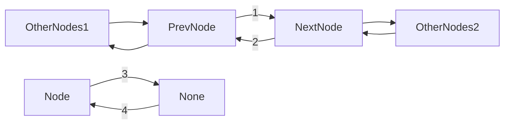

# LRU cache

## Основные методы класса

LRU cache ( least recently used ) по определению должен содержать три основных метода, которые должны выполнятся за **константное время**:

1. ```get(key)``` - возвращает значение соответствующие ключу key, и меняет его приоритет.

2. ```set(key,value)``` - если данный ключ отсутствует, то добавляет его значение в кэш. В противном случае изменяет значение ключа на новое знаечние, и меняет приоритет запроса.

3. ```delete(key)``` - удаляет значение из кэша соответствующие данному ключу.

## Структуры данных, необходимые для реализации класса

Данный класс я реализовал с помощью **двусвязных списков** и **хеш таблиц**. Двусвязный список необходим для того, чтобы добиться константного времени выполнения таких операций как добавление элемента в начало хэша и **удаление** его. Хеш таблица необходима для быстрого выполнения операции **поиска** элемента по ключу.

## Двусвязный список

### Класс Node

```python
class Node:
    def __init__(self, key, value):
    self.key = key
    self.value = value
    self.next = None
    self.prev = None
```

Класс Node имеет 4 поля: ключ, значение, ссылка на предыдущий элемент и на следующий.


### Класс DoublyLinkedList

```python
class DoublyLinkedList:
  
    # Constructor for empty Doubly Linked List
    def __init__(self, capacity: int=10):
        self.len = 0
        self.capacity = capacity

        self.head = Node(0, 0)
        self.tail = Node(0, 0)

        self.tail.prev = self.head
        self.tail.next = None
        self.head.next = self.tail
        self.head.prev = None

    def push(self, new_node):
        pass
    def remove(self, node):
        pass
```

В конструкторе класса мы добавляем поле```self.capacity```, которое хранит максимальное значение длины кэша, ```self.len``` содержит длину и экземпляры класса ```Node```:```self.head``` и ```self.tail```. ```self.head.next``` будет в дальнейшем первым элементом кэша, а ```self.tail.prev``` - последним.

#### Метод push

```python
    # Adds new node to the beginning
    def push(self, new_node):
        if self.len == 0:
            self.head.next = new_node
            new_node.prev = self.head
            new_node.next = self.tail
            self.tail.prev = new_node

            self.len += 1

        elif self.len < self.capacity:
            old_first = self.head.next

            self.head.next = new_node
            new_node.prev = self.head
            new_node.next = old_first
            old_first.prev = new_node

            self.len += 1

        else:
            old_first = self.head.next

            self.head.next = new_node
            new_node.prev = self.head
            new_node.next = old_first
            old_first.prev = new_node

            old_last = self.tail.prev

            self.tail.prev = old_last.prev
            old_last.prev.next = self.tail
```

Первым мы рассмотрим метод ```push```, который просто дабавляет новый элемент в двусвязный список, если ```self.len < self.capacity```. В противном случае он также добавит элемент в начало списка, но еще удалит последний.
Если список пуст, то выполняется следующий блок кода:

```python
        if self.len == 0:
            self.head.next = new_node # 1
            new_node.prev = self.head # 2
            new_node.next = self.tail # 3
            self.tail.prev = new_node # 4

            self.len += 1
```

**Здесь и далее в схемах номер в схеме соответствует комментарию в коде к строке**


В случае если список не пуст, но его длина не максимальна, выполняется код:

```python
        elif self.len < self.capacity:
            old_first = self.head.next

            self.head.next = new_node # 1
            new_node.prev = self.head # 2
            new_node.next = old_first # 3
            old_first.prev = new_node # 4

            self.len += 1
```


В случае если список уже заполнен до предела:

```python
        else:
            old_first = self.head.next

            self.head.next = new_node # 1
            new_node.prev = self.head # 2
            new_node.next = old_first # 3
            old_first.prev = new_node # 4

            old_last = self.tail.prev

            self.tail.prev = old_last.prev # 5
            old_last.prev.next = self.tail # 6

            old_last.next = None # 7
            old_last.prev =None # 8
```



#### Метод remove

```python
    def remove(self, node):
        node.prev.next = node.next # 1
        node.next.prev = node.prev # 2

        node.next = None # 3
        node.prev = None # 4

        self.len -= 1
```



## Класс LRUCache

```python
class LRUCache:

    def __init__(self, capacity: int=10) -> None:
        self.capacity = capacity
        self.hash_table = {}
        self.linked_list = DoublyLinkedList(capacity)

    def set(self, key: str, value: str) -> None:
        pass

    def get(self, key):
        pass

    def delete(self, key: str) -> None:
        pass
```

Класс имеет три поля:

1. ```self.capacity``` - размерность кэша.
2. ```self.hash_table``` - название говорит само за себя. Реализована с помощью словаря.
3. ```self.linked_list``` - двусвязный список, экземпляр класса ```DoublyLinkedList```.

#### Метод set

```python
    def set(self, key: str, value: str) -> None:
        new_node = Node(key, value)
        if key not in self.hash_table.keys():
            if len(self.hash_table) < self.capacity:
                self.hash_table[key] = new_node
                self.linked_list.push(new_node)
            elif len(self.hash_table) == self.capacity:
                last_node = self.hash_table.pop(self.linked_list.tail.prev.key)
                self.linked_list.remove(last_node)

                self.hash_table[key] = new_node
                self.linked_list.push(new_node)
            else:
                pass
        else:
            old_node = self.hash_table.pop(key)
            self.linked_list.remove(old_node)
            self.linked_list.push(new_node)

            self.hash_table[key] = new_node
```

Создается экземпляр класса ```Node``` если данного ключа нет в ```self.hash_table```, то он добавляется в начало двусвязного списка. Если длина кэша максимальна, то удаляется последний элемент, имеющий самый маленький приоритет.

Если ключ все-таки присутствует в ```self.hash_table```, то удаляется элемент со старым значением из двусвязного списка и добавляется в начало новый с тем же значением ключа, но уже с обновленным значением.

#### Метод get

```python
    def get(self, key):
        if key in self.hash_table.keys():
            value = self.hash_table[key].value
            new_node = Node(key, value)
            self.linked_list.remove(self.hash_table[key])
            self.linked_list.push(new_node)
            return value
        return ''
```

Выводит значение из кэша по ключу и меняет его приоритет.

#### Метод delete

```python
    def delete(self, key: str) -> None:
        deleted_node = self.hash_table.pop(key)
        self.linked_list.remove(deleted_node)
```

Удаляет значение по ключу из кэша.

## Быстрый способ создания LRU cache

Можно быстро реализовать LRU cache с помощью ```OrderedDict```. Данный способ показан в файле ```LRUcacheSimpleю.py```.